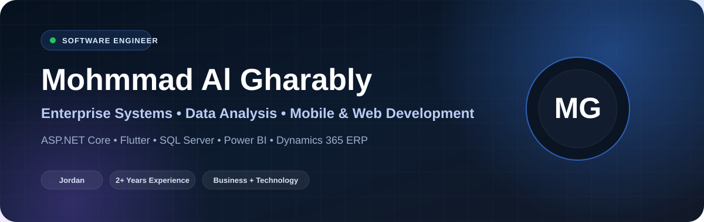
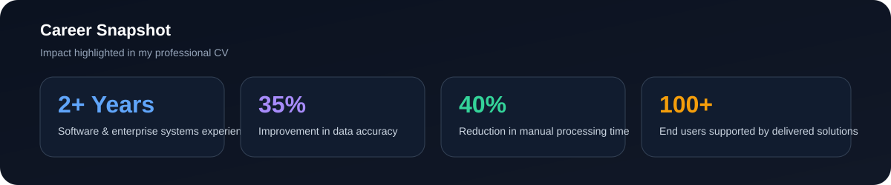
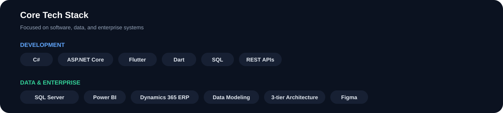

### Software Engineer | ASP.NET Core | Flutter | SQL Server | Power BI | Dynamics 365 ERP

📍 Jordan &nbsp; • &nbsp; 📧 [mohmmad.abdr@outlook.com](mailto:mohmmad.abdr@outlook.com) &nbsp; • &nbsp; 📱 [+962 799693335](tel:+962799693335)

[LinkedIn](https://linkedin.com/in/mohmmad-al-gharably-602268232) • [GitHub](https://github.com/mohmmadabdr) • [daily.dev](https://app.daily.dev/mohmmadabdr1)

---

## 👨‍💻 Profile

Software Engineer with **2+ years of experience** delivering scalable applications, optimizing SQL databases, and integrating enterprise systems. Improved data accuracy by up to **35%** through automated SQL audits, reduced manual processing time by **40%**, and contributed to building mobile and desktop solutions used by **100+ end users**.

Skilled in **ASP.NET Core, Flutter, SQL Server, and Power BI**, with a strong ability to translate business needs into working technical solutions.

 

---

## 💼 Professional Experience

### IT & Management Audit Assist — Mostaqbal Company
**06/2024 – Present**

- Conduct advanced **SQL-based data analysis** to evaluate internal controls and system integrity.
- Extract and analyze large datasets from **Microsoft Dynamics 365** to identify discrepancies in payroll, permissions, and financial records.
- Develop SQL scripts to automate audit testing and improve accuracy of results.
- Build **Power BI dashboards** to visualize audit findings and support decision-making.
- Act as the technical bridge between audit and IT teams to implement data-driven corrective actions.

### IT Support Specialist — Immediate Support for PCs
**01/2023 – 07/2024**

- Troubleshot and repaired laptops, PCs, and printers across hardware and software issues.
- Handled OS installation, configuration, virus removal, and user technical support.
- Improved user productivity by providing guidance and training on IT systems.

### System Developer Intern — Aqaba Water Company
**02/2022 – 02/2023**

- Designed and managed **MS SQL Server** databases for ASP.NET Core systems.
- Developed stored procedures and optimized SQL queries to fully automate invoicing within **Dynamics 365 ERP**.
- Built subscriber validation tools to ensure data integrity during ERP rollout.
- Designed secure APIs connecting mobile apps with backend financial data.
- Strengthened core expertise in **T-SQL, backend development, and enterprise systems**.

---

## ⚡ Technical Skills

**Languages:** C#, Dart, SQL, HTML, CSS, C++  
**Frameworks:** ASP.NET Core, Flutter  
**Database:** MS SQL Server  
**Tools:** Power BI, Figma, Dynamics 365 ERP  
**Other:** API Development, 3-tier Architecture, Data Modeling

---

## 🚀 Projects

### Auiva App
**Flutter + ASP.NET Core** architectural design gallery application.

### Coffee App
Personalized recommendations using **data analytics**.

### E-Commerce App
Full mobile store built using **Flutter**.

### SIAS API Project
Team-based **3-tier ASP.NET Core architecture** project.

---

## 🎓 Education

**Bachelor’s Degree in Software Engineering**  
Al-Hussein Bin Talal University  
**2019 – 2023 | GPA: 75**

---

## 📚 Courses & Professional Development

### Professional Power BI Program — University of Jordan, Aqaba
**06/2025**

1-week intensive program focused on enterprise-level Power BI development, including **data modeling, DAX, Power Query, SQL integration, and interactive dashboards** for professional reporting.

### Flutter Development — Dot Jordan
**2025**

Advanced Flutter program covering **UI development, state management, clean architecture, API integration, Firebase services, and the full mobile app lifecycle**.

### Power BI & Data Analysis — The Hope
**2025**

Training in building complete Power BI dashboards, data modeling, KPI design, Power Query transformations, and connecting reports to SQL Server data sources.

### Bank Reconciliation & Financial Systems — Sulav Academy
**2024**

Developed a Microsoft Access reconciliation system and gained strong understanding of general ledger flow, debit/credit principles, and financial control processes.

### Microsoft Dynamics 365 HR — Aqaba Water Company
**2023**

Practical experience managing HR data, salary structures, and employee records using Microsoft Dynamics 365, with exposure to HR workflows and system configuration.

### Flutter Development — Orange Coding Academy
**2023**

Built multiple mobile apps including e-commerce and recommendation systems; trained in UI/UX fundamentals, reusable widget design, and backend API integration.

### Retail & Business Communication — EFE Jordan / Boeing
**2022**

Structured training in communication skills, English business communication, and retail sales with a focus on customer interaction and professional communication.

---

## 🤝 Soft Skills

**Teamwork** • **Problem-solving** • **Work ethic** • **Adaptability** • **Time management** • **Communication** • **Creativity** • **Attention to detail**

---

## 🌍 Languages

- **Arabic:** Mother Tongue
- **English:** Intermediate A2

---

## 📬 Contact

- **Location:** Jordan
- **Email:** [mohmmad.abdr@outlook.com](mailto:mohmmad.abdr@outlook.com)
- **Phone:** [+962 799693335](tel:+962799693335)
- **LinkedIn:** [Mohmmad Al Gharably](https://linkedin.com/in/mohmmad-al-gharably-602268232)
- **GitHub:** [mohmmadabdr](https://github.com/mohmmadabdr)

---

### Building software that connects technology with real business needs.

ASP.NET Core • Flutter • SQL Server • Power BI • Dynamics 365 ERP

